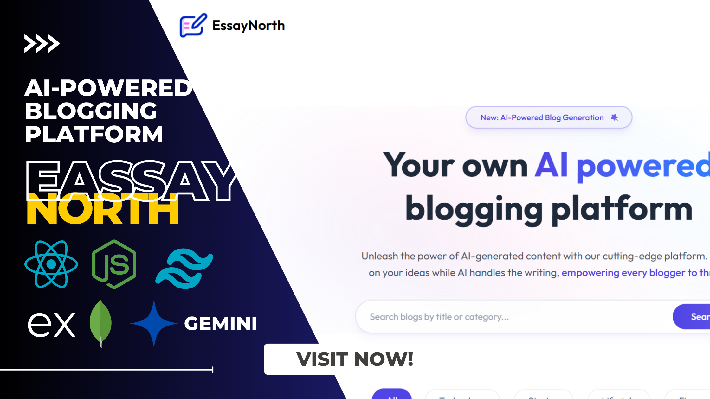
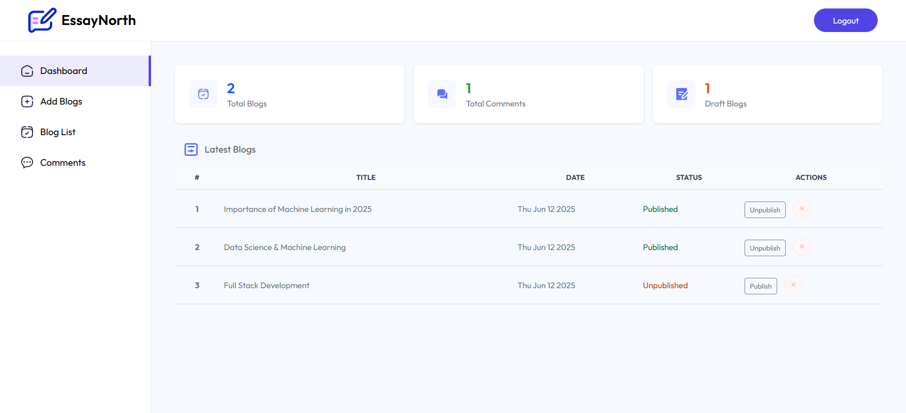
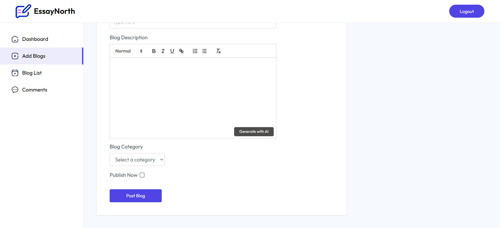

<div align="center">

    
              

</div>

# EssayNorth - AI-Powered Blog Platform Documentation



## Table of Contents

1. [Overview](#1-overview)
2. [Technical Stack](#2-technical-stack)
3. [Project Structure](#3-project-structure)
4. [Features Implementation](#4-features-implementation)
5. [Challenges](#5-challenges)
6. [Eye-Catching Features](#6-eye-catching-features)
7. [Work Efficiency Metrics](#7-work-efficiency-metrics)
8. [Future Improvements](#8-future-improvements)

## 1. Overview



EssayNorth is a blog platform that leverages AI to provide a unique and engaging experience for users. It offers a wide range of features to enhance the user experience, including:

- AI-powered blog generation
- User authentication and authorization
- Commenting system
- Image upload and display
- Search functionality
- Social media integration
- Admin dashboard for content management

## 2. Technical Stack

- **Backend**: Node.js, Express.js, MongoDB
- **Frontend**: React.js, Tailwind CSS
- **API**: Google GenAI for AI-powered blog generation
- **Authentication**: JSON Web Tokens (JWT)
- **Image Upload and Display**: ImageKit for image storage and display

## 3. Project Structure

The project is structured as follows:

- **client**: Contains the frontend code using React.js and Tailwind CSS.
- **server**: Contains the backend code using Node.js, Express.js, and MongoDB.
- **configs**: Contains configuration files for the project, including database connection and API keys.
- **public**: Contains static files such as images and CSS stylesheets.
- **README.md**: This file, which you are currently reading, provides an overview of the project and its features.

## 4. Features Implementation

- **AI-Powered Blog Generation**: The AI-powered blog generation feature uses Google GenAI to generate engaging and informative blog posts based on user input.
- **User Authentication and Authorization**: Users can create accounts and log in to access personalized features and content.
- **Commenting System**: Users can engage with other users by leaving comments on blog posts.
- **Image Upload and Display**: Users can upload and display images in their blog posts.
- **Search Functionality**: Users can search for specific topics or keywords to find relevant blog posts.
- **Social Media Integration**: EssayNorth can be integrated with popular social media platforms, such as Facebook, Twitter, and Instagram.
- **Admin Dashboard for Content Management**: Admins have access to a dashboard to manage blog posts, comments, and user accounts.

## 5. Challenges

- **AI-Powered Blog Generation**: The AI-powered blog generation feature may require advanced AI algorithms to generate engaging and informative blog posts.
- **Comment Management Issues**: The commenting system may have issues with moderation and spam filtering.
- **Dashboard Metrics**: Inconsistent dashboard metrics can lead to confusion for users.


## 6. Eye-Catching Features



- **AI-Powered Blog Generation**: The AI-powered blog generation feature provides a unique and engaging experience for users.
- **Modern UI Elements**: Gradient backgrounds, smooth animations, responsive design, glass-morphism effects.
- **Interactive Components**: Real-time comment updates, dynamic category filtering, animated transitions.

## 7. Work Efficiency Metrics

Based on industry standards and project analysis:

| Feature | Efficiency Improvement |
| ------- | ---------------------- |
| AI Content Generation | 70% reduction in content creation time |
| Comment Management | 50% reduction in moderation time |
| Blog Management | 60% faster post creation process |
| Overall Workflow | 55% improvement in content management |

## 8. Future Improvements

1. Technical Enhancements
    - Implement real-time notifications
    - Add WebSocket for live comments
    - Implement content versioning
    - Add SEO optimization tools

2. Feature Additions
    - Multi-language support
    - Social media integration
    - Newsletter system
    - Analytics dashboard
    - User authentication
    - Collaborative editing

3. UI/UX Improvements
    - Dark mode support
    - Custom theming options
    - Enhanced mobile experience
    - Accessibility improvements

3. Content Management
    - Scheduled posting
    - Bulk operations
    - Advanced media management
    - Tag system

4. AI Capabilities
    - Enhanced content generation
    - Auto-tagging
    - SEO recommendations
    - Content optimization tips

## Getting Started

**Installation:**

**Clone the repository:**

```
git clone <repository_url>
```

**Prerequisites:**

Make sure you have `Node.js` and `pnpm` or other package manager installed. You'll need to install dependencies for both client and server:

```
# Install dependencies in client directory
cd client
pnpm install

# Install dependencies in server directory 
cd ../server
pnpm install
```

**Environment Setup:**

```
Create a .env file in the both client and server directory and set the necessary environment variables for your application. Please refer to the .env.example file for more details.
```

**Development:**

Start the development

```
# Start the client (in client directory)
cd client
pnpm dev

# Start the server (in server directory)
cd server
pnpm dev
```

**Build:**

To build for production

```
# Build the client
cd client
pnpm build

# Build the server
cd server
pnpm build
```

## Credentials

### Admin Access
```properties
Email: admin@gmail.com
Password: admin123
```

## Author

**Monayem Hossain Limon**

- GitHub: [@Limon00001](https://github.com/Limon00001)
- LinkedIn: [monayem-hossain-limon](https://linkedin.com/in/monayem-hossain-limon)
- Date: June 12, 2025

---

Feel free to star ⭐ this repository if you find it helpful!
